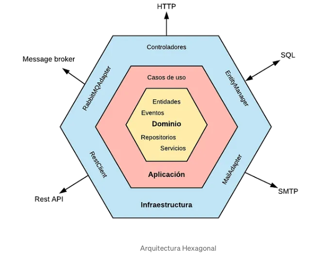
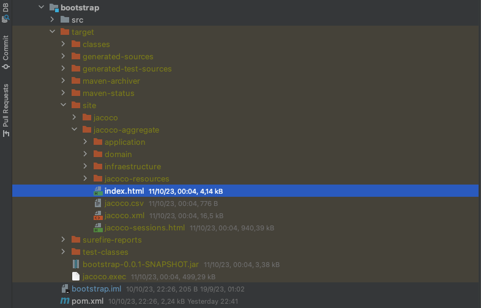
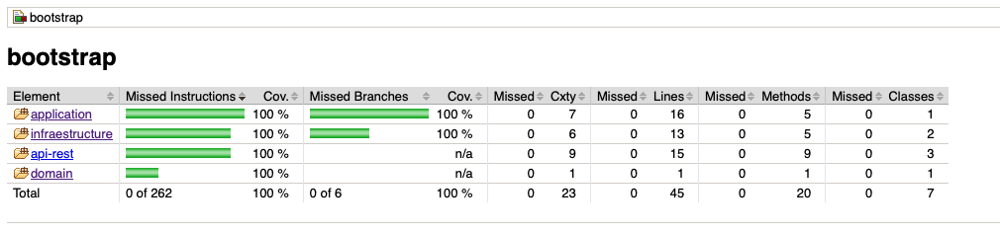

# Rest API APPZARA

<p>This is a microservice rest for ZARA recruitment.</p>

## About this project
* [About](#about)
* [Architecture](#architecture)
* [Techinologies](#techinologies)
* [How to run](#how-to-run)
* [How to run tests](#how-to-run-tests)
* [Contributors](#contributors)

# About
**Business rules**
<p> Given a day and time, a database search is carried out to bring up the price with the tariff to be applied.
If more than one element is found, some rules will apply:</p>
<ul> 
    <li>If the result finds two rates that coincide, the one with the highest value will apply.</li> 
</ul>

# Architecture


#### APPLICATION
Layer that implements UseCase and is responsible for communicate with others modules e.g. Infrastructure.

#### BOOTSTRAP
Instantiates adapters and domain services and starts the entire application.

#### INFRAESTRUCURE
Layer that communicate with outside, e.g. http request, databases or brokers messages.

# Technologies
- Java 17
- Spring boot 3.1.3
- Spring Data
- H2 Memory
- Jacoco Reporter

# How to Run
<p>
Import in your IDE and execute the main class AppZaraApplication localized on bootstrap module.
In the API-REST module there is a PriceController with a GET endpoint with the following parameters:

- startDate: date **must be int the format yyyy-MM-dd-HH.mm.ss** e.g. 2020-06-16-21.00.00
- productId: id of product e.g. 35455
- brandId: id of brand e.g: 1 (ZARA)
</p>

<p>A example of request:</p>

```shell
curl --location 'http://localhost:8080/price/startDate/2020-06-14-10.00.00/productId/35455/brandId/1'
```
<p>Let us to some example of request</p>
<p>Request to day 14 of 2020 at 10:00 hrs</p>
<p>The response will be:</p>

```json lines
{
  "brandId": 1,
  "productId": "35455",
  "priority": 1,
  "rate": 4,
  "startDate": "2020-06-15T16:00:00",
  "endDate": "2020-12-31T23:59:59",
  "amount": 38.95
}
```

<p>Request to day 14 of 2020 at 16:00 hrs</p>
<p>The response will be:</p>

```json lines
{
  "brandId": 1,
  "productId": "35455",
  "priority": 1,
  "rate": 4,
  "startDate": "2020-06-15T16:00:00",
  "endDate": "2020-12-31T23:59:59",
  "amount": 38.95
}
```

<p>Request to day 14 of 2020 at 21:00 hrs</p>
<p>The response will be:</p>

```json lines
{
    "brandId": 1,
    "productId": "35455",
    "priority": 1,
    "rate": 4,
    "startDate": "2020-06-15T16:00:00",
    "endDate": "2020-12-31T23:59:59",
    "amount": 38.95
}
```

<p>Request to day 15 of 2020 at 21:00 hrs</p>
<p>The response will be:</p>

```json lines
{
    "brandId": 1,
    "productId": "35455",
    "priority": 1,
    "rate": 4,
    "startDate": "2020-06-15T16:00:00",
    "endDate": "2020-12-31T23:59:59",
    "amount": 38.95
}
```
<p>Request to day 16 of 2020 at 21:00 hrs</p>
<p>The response will be:</p>

```json lines
{
    "brandId": 1,
    "productId": "35455",
    "priority": 1,
    "rate": 3,
    "startDate": "2020-06-15T00:00:00",
    "endDate": "2020-06-15T11:00:00",
    "amount": 30.50
}
```

# How to run Tests

<p> This project has jacoco-report with we are able to see coverage after execute tests.
Once you are inside appzara (pom.xml parente) open your favorite prompt execute:</p>

```
mvn test
```

After execute tests jacoco-report will generate an index.html file with coverage.
The directory of this file is `appzara/bootstrap/target/site/jacoco-aggregate/index.html`.



<p>Open it in your default browser to see the coverage of each module</p>



## Contributors
[@LauroSilveira](https://github.com/LauroSilveira)
